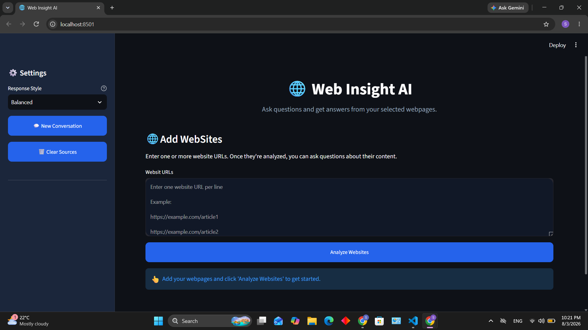
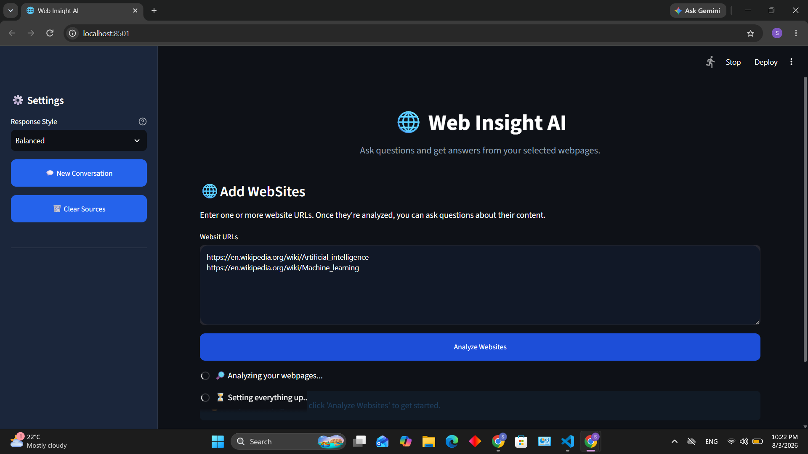
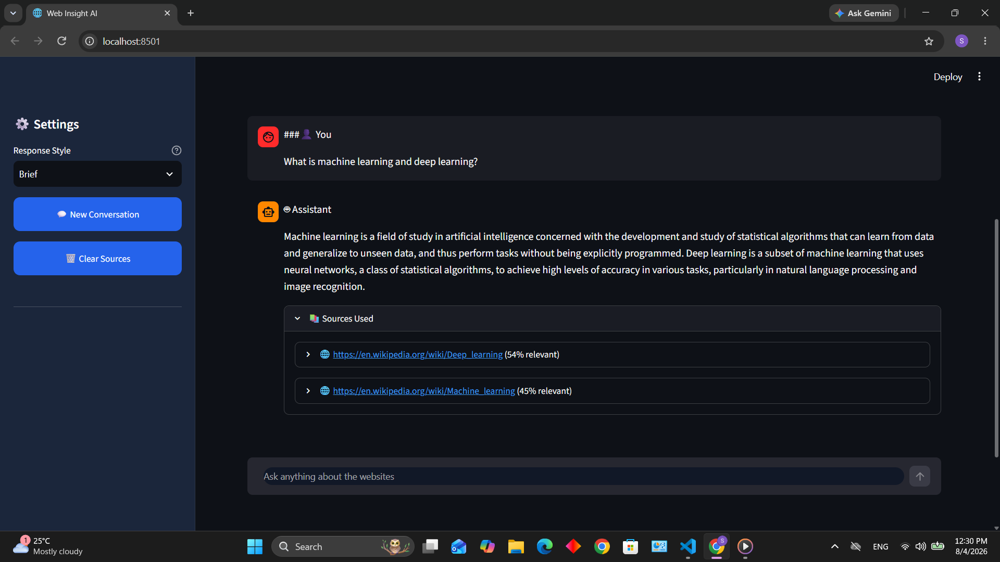

# Web Insight AI
Web Insight AI is a Retrieval-Augmented Generation (RAG) application that enables users to ask questions about the content of one or more websites. Instead of manually searching through lengthy webpages, users can provide website URLs and receive context-aware answers generated from the retrieved webpage content.

The application combines web scraping, semantic search, vector embeddings, and a Large Language Model (LLM) to build an end-to-end RAG pipeline.

---

## Project Overview

The application works by extracting text from one or more webpages, cleaning the content, splitting it into overlapping text chunks, generating vector embeddings using Sentence Transformers, and storing those embeddings in a FAISS vector database.

When a user asks a question, the application retrieves the most relevant text chunks through semantic search and provides them to the language model, which generates an answer based only on the retrieved context.
---

## Live Demo

🔗 Streamlit App: https://web-insight-ai-nxnfqgrqnpvykizs6axwzb.streamlit.app/

**Note:** The application is deployed on Streamlit Cloud. Due to the memory limitations of the free hosting environment, processing very large webpages may fail or take longer. The complete implementation and workflow can be explored through the source code available in this repository.


## Features

- Process one or multiple website URLs
- Automatic webpage text extraction
- HTML cleaning and preprocessing
- Overlapping text chunking
- Semantic search using Sentence Transformers
- Fast vector similarity search using FAISS
- Context-aware question answering with Retrieval-Augmented Generation (RAG)
- Adjustable response styles (Brief, Balanced and Detailed)
- Interactive Streamlit interface
- Displays the source webpages used to generate each answer

---

## Technology Stack

**Programming Language**
- Python

### Framework

- Streamlit

**Libraries and Frameworks**

- BeautifulSoup
- Requests
- Sentence Transformers
- FAISS
- Hugging Face Transformers
- PyTorch
- NumPy

---
## Skills Demonstrated

- Retrieval-Augmented Generation (RAG)
- Large Language Models (LLMs)
- Semantic Search
- Information Retrieval
- Vector Embeddings
- FAISS Vector Indexing
- Prompt Engineering
- Web Scraping
- Text Chunking and Preprocessing
- Streamlit Application Development
- Hugging Face Transformers
- Python

### Language Model

- Qwen2.5-1.5B-Instruct(Local Hugging Face model)

---


## Project Workflow

1. Enter one or more website URLs.
2. Extract webpage content using BeautifulSoup.
3. Remove unnecessary HTML elements and clean the extracted text.
4. Split the text into overlapping chunks.
5. Generate vector embeddings using Sentence Transformers.
6. Store embeddings in a FAISS vector index.
7. Ask questions about the website content.
8. Retrieve the most relevant chunks using semantic search.
9. Generate a context-aware answer using the language model.
10. Display the retrieved source webpages along with the generated answer.

## System Architecture

```
User
   │
   ▼
Enter Website URLs
   │
   ▼
Web Scraping (Requests + BeautifulSoup)
   │
   ▼
Text Cleaning
   │
   ▼
Chunking
   │
   ▼
Sentence Transformer Embeddings
   │
   ▼
FAISS Vector Database
   │
   ▼
Semantic Retrieval
   │
   ▼
Qwen2.5-1.5B-Instruct
   │
   ▼
Answer Generation
---

## Project Structure

```
Web Insight AI
│
├── .gitignore                             
├── README.md             
├── app.py                 # Streamlit application       
├── chunk.py               # Splits extracted text into chunks
├── index.py               # Creates and manages the FAISS index
├── ragchat.py             # RAG pipeline and question answering
├── requirements.txt       # Project dependencies      
├── scraper.py             # Extracts content from webpages
└── style.css              # Custom UI styling
```
## Application Screenshots

### Home Page

<p align="center">
  
</p>

---

### Analyze Websites Analysis

<p align="center">
  
</p>

---

### Answer Generation

<p align="center">
  
</p>

---

## Installation

Clone the repository

```bash
git clone https://github.com/tamusyosus/web-insight-ai.git
```

Navigate to the project directory

```bash
cd web-insight-ai
```

Install the required packages

```bash
pip install -r requirements.txt
```

Run the application

```bash
streamlit run app.py
```
## Hardware Requirements

This project runs the **Qwen2.5-1.5B-Instruct** language model locally for response generation.

For the best experience, the recommended system configuration is:

- CUDA-compatible NVIDIA GPU (recommended)
- 16 GB RAM minimum (32 GB recommended)
- Python 3.11+
- Internet connection for downloading models during the first run

The application automatically uses GPU acceleration when CUDA is available. On systems without a CUDA-compatible GPU or with limited memory, model loading and response generation may be slower, and memory-related errors may occur.

---


## Deployment

A Streamlit Community Cloud deployment was created for this project. However, the application uses the **Qwen2.5-1.5B-Instruct** language model for local inference, which may exceed the memory limits of the free hosting environment during website analysis.

The application runs successfully in a local environment. For production deployment, it can be hosted on infrastructure with sufficient CPU/GPU memory or integrated with an external inference service.


## Future Improvements

- Support PDF documents
- Support additional document formats
- Maintain conversation history
- Support for multiple embedding models
- Source citation improvements


---


## Author

**Sushmita Gurung**

- GitHub: https://github.com/tamusyosus
- LinkedIn: https://www.linkedin.com/in/sushmitagurung/
